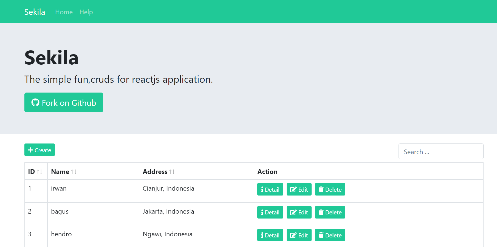

# Sekila
### Simple starter CRUD template with react redux

#### The simple fun,cruds for reactjs application.

with https://jsonplaceholder.typicode.com/
using fake api : https://my-json-server.typicode.com/irwansah/backend/users/
> put and post not really change on backend because this is fake api, use your own rest api to manage data

## Included Dependency

- React "17.0.2"
- Fontawesome with react-fontawesome "0.1.15"
- Axios "^0.21.1"
- Bootstrap 5 with react-bootstrap "5.0.2"
- React Bootstrap Table 2 "4.0.3"
- node-sass "6.0.1"
- react-redux  "^7.2.4"
- react-router-dom "5.2.0"
- redux-form  "8.3.7"
- redux-thunk  "2.3.0"
- sweetalert  "2.1.2"

> dont forget run `npm install`

